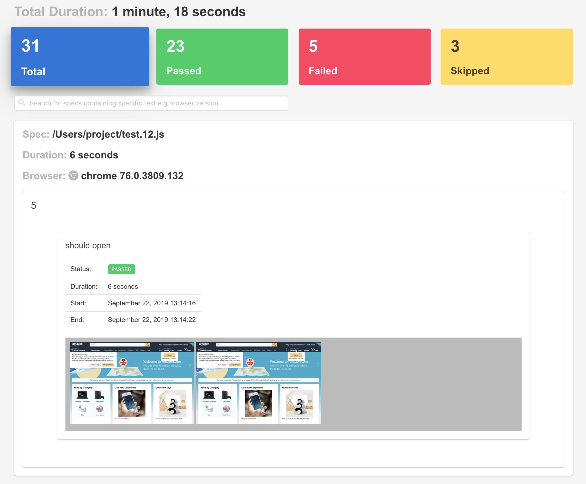

Wdio Timeline Reporter 
======================
[]()[]()[]()

> A one stop shop WebdriverIO reporter for an aggregated visualisation of your test results because "Seeing is believing"



## Why use it? 
Because we spend a lot of time debugging failing tests switching from terminal output to viewing error screenshots etc. This reporter aggregates all the typical information you will need into one report. Run tests and have a nice timeline of events you can look back at to further verify everything looks ok. Quite a few other use cases out there...

#### Features include:
1. Works great with Mocha and Jasmine frameworks. Also works with Cucumber but every step will be reported as a test)
2. Loud Summary of the Test Results.
3. Detail of each test run including all screenshots captured during test execution.
4. Test Results filtering. Great for focusing on failed tests
5. Error stack trace attached to test.
6. Ability to add additional information to test at runtime.
7. No post processing required. On completion of wdio test process, a static html report file will get generated.
8. Screenshot service to manage the taking of screenshots including resizing of the images.
   
__Note that inbuilt image manipulation capability makes this reporter quite sizeable in comparison to the others__
   
An example html report can be found [here](http://htmlpreview.github.io/?https://github.com/QualityOps/wdio-timeline-reporter/blob/master/images/example-timeline-report.html)  

Instructions on how to install `WebdriverIO` can be found [here](http://webdriver.io/guide/getstarted/install.html).


## Installation

```shell
npm install --save wdio-timeline-reporter
```

A dependency will be added to your `package.json`

```json
{
  "dependencies": {
    "wdio-timeline-reporter": "^2.0.1"
  }
}
```

### Usage

 Add ```timeline``` to the reporters array in your wdio config file.

```js
// wdio.conf.js
module.exports = {
  // ...
  reporters: ['timeline'],
  // ...
};
```

### Reporter Configuration

The following configuration options are supported:

| option | default | type | description |
| - | - | - | - |
| outputDir | ./ | string | directory you want the report html file written to. It defaults to the current working directory |
| filename | timeline-reporter.html   | string |name of the html file. File has to have html extension or default filename will be used |
| embedImages | false   | boolean |use this if you want to embed screenshots as base64 to the report. Great option if you wish to archive just one artifact on CI server but be weary of the size the file could be |


If you wish to override the default configuration add a ```timelineReporter``` object to ```reporterOptions``` in your wdio config as shown below.
```js
// wdio.conf.js
module.exports = {
  // ...
  reporters: ['timeline'],
  reporterOptions: {
    timelineReporter: {
        outputDir: './output',
        fileName: 'test-report.html',
        embedImages: true
    }
  },
  // ...
};
```

### Add additional information to test context
It is possible to add additional information to a test using the `addContext` static method. This can be useful for adding important information that could help in debugging failed tests for example a user created during the test run with a dynamic username

#### Basic usage
The `TimelineReporter.addContext` static method accepts either a string parameter or an object literal with two properties `title` and `value` e.g 
```js
{ title: 'sessionId', value: 'b59bb9ec-ab15-475e-9ce6-de8a14ca0cd3' }
```
value could be also be a link

##### Mocha example
```js
const TimelineReporter = require('wdio-timeline-reporter');

describe('Suite', function() {
    it('Test', function() {
        // object literal parameter
        TimelineReporter.addContext({
          title: 'Test User',
          value: 'user id created during the test'
        });

        // value as anchor tag
        TimelineReporter.addContext({
          title: 'Test User',
          value: '<a href="">Some important link related to test</a>'
        });

        // string parameter
        TimelineReporter.addContext('This test might be flaky');
    });
});
```


Screenshot Service
==================
The Screenshot Service is a webdriverIO service written to work in tandem with timeline reporter. As you can guess from the name, the service takes screenshots during tests execution. You have the option to reduce the size and quality of the images. This is configurable using options the service provides. You would not require to specify `screenshotPath` in wdio.conf.js as the service will replicate the feature provided by supplying that property.

Note that this service does not have to be used with the reporter. Any screenshots taken during test execution will by default end up in the reporter.

### Usage
 Import or require the module from `wdio-timeline-reporter` as shown below and then add `ScreenshotService` to the services array in your wdio config file.

```js
// wdio.conf.js
const ScreenshotService = require('wdio-timeline-reporter/screenshot-service')

module.exports = {
  // ...
  services: [ ScreenshotService ],
  // ...
};
```
### Service Configuration
If you wish to override the default configuration, add a screenshotService object to your wdio config as shown below.

```js
// wdio.conf.js
const ScreenshotService = require('wdio-timeline-reporter/screenshot-service')

module.exports = {
  // ...
  services: [ ScreenshotService ],
  screenshotService: {
        outputDir: './output',
        images: {
            quality: 80,
            resize: true,
            reductionRatio: 2
        },
        strategy: 'verbose'
    }
  // ...
};
```
Configuration options are explained below

| option | default | type | description |
| -- | -- | -- | -- |
| outputDir | ./ | string | directory where screenshots will be saved. Defaults to working directory |
| images | ```{ quality: 70, resize: false, reductionRatio: 1 }``` | object (quality and reductionRatio are of type Number and resize is a boolean) | if resize is true, service will use `quality` and `reductionRatio` values to resize the images. Resizing is a great option if you chose to embed your images as base64. Allowed range for `images.quality` are `1 - 100` inclusive and `1 - 5 ` for `images.reductionRatio` |
| strategy | none | string | `none` will not take any screenshots, `error` will take screenshots only on error, `verbose` will take screenshots before every click |